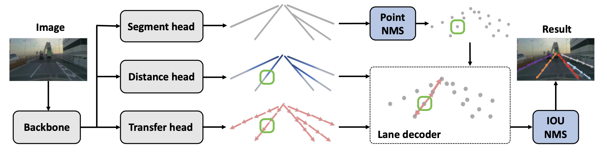

# RCLane: Relay Chain Prediction for Lane Detection
[Paper](https://arxiv.org/abs/2207.09399)
> [**RCLane: Relay Chain Prediction for Lane Detection**](https://arxiv.org/abs/2207.09399),            
> Shenghua Xu, Xinyue Cai, Bin Zhao, Li Zhang, Hang Xu, Yanwei Fu, Xiangyang Xue        
> **ECCV 2022**

## News
- [2022/07/04]: RCLane is accepted by **ECCV 2022**!

## Abstract
Lane detection is an important component of many realworld autonomous systems. Despite a wide variety of lane detection approaches have been proposed, reporting steady benchmark improvements over time, lane detection remains a largely unsolved problem. This is because most of the existing lane detection methods either treat the lane detection as a dense prediction or a detection task, few of them consider the unique topologies (Y-shape, Fork-shape, nearly horizontal lane) of the lane markers, which leads to sub-optimal solution. In this paper, we present a new method for lane detection based on relay chain prediction. Specifically, our model predicts a segmentation map to classify the foreground and background region. For each pixel point in the foreground region, we go through the forward branch and backward branch to recover the whole lane. Each branch decodes a transfer map and a distance map to produce the direction moving to the next point, and how many steps to progressively predict a relay station (next point). As such, our model is able to capture the keypoints along the lanes. Despite its simplicity, our strategy allows us to establish new state-of-the-art on four major benchmarks including TuSimple, CULane, CurveLanes and LLAMAS.

## Methods


## Result
### **Lane detection on CULane dataset**
|  Model   |   F1   |  Params |  FPS  |
| :------: | :----: | :-----: | :---: |
| RCLane-S |  79.52 |   6.3   | 45.6  |
| RCLane-M |  80.03 |   17.2  | 43.8  |
| RCLane-L |  80.50 |   30.9  | 24.5  |

### **Lane detection on CurveLanes dataset**
|   Model  |    F1   | Precision  | Recall |
| :------: | :-----: | :--------: | :----: |
| RCLane-S |  90.47  |    93.33   |  87.78 |
| RCLane-M |  90.96  |    93.47   |  88.58 |
| RCLane-L |  91.43  |    93.96   |  89.03 |


### **Lane detection on LLAMAS dataset**
|   Model  |    F1   | Precision  | Recall |
| :------: | :-----: | :--------: | :----: |
| RCLane-S |  96.05  |    96.70   |  95.42 |
| RCLane-M |  96.03  |    96.62   |  95.45 |
| RCLane-L |  96.13  |    96.79   |  95.48 |

### **Lane detection on Tusimple dataset**
|   Model  |   F1   |   Acc  |   FP  |   FN  |
| :------: | :----: | :----: | :---: | :---: |
| RCLane-S |  97.52 |  96.49 | 2.21 |  2.57  |
| RCLane-M |  97.61 |  96.51 | 2.24 |  2.36  |
| RCLane-L |  97.64 |  96.58 | 2.28 |  2.27  |

## License

[MIT](LICENSE)
## Reference

```bibtex
@inproceedings{xu2022rclane,
  title={Relay Chain Prediction for Lane Detection},
  author={Xu, Shenghua and Cai, Xinyue and Zhao, Bin and Zhang, Li and Xu, Hang and Fu, Yanwei and Xue, Xiangyang},
  booktitle={European Conference on Computer Vision},
  year={2022}
}
```
## Acknowledgement

* [MindSpore](https://github.com/omindspore-ai/mindspore)
